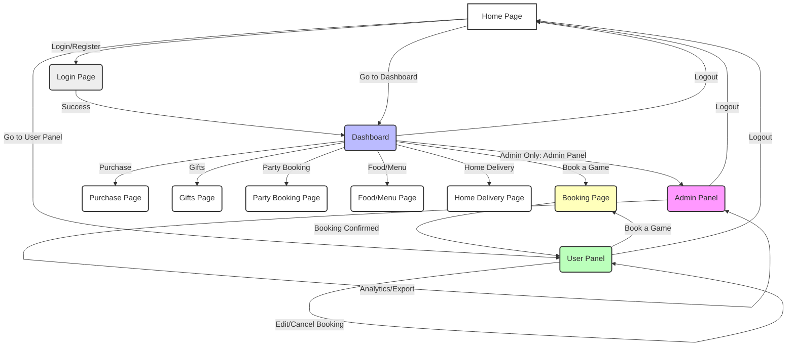

# Club Booking App

This is a Vite + React project for a club booking system, using Tailwind CSS and React Router.

## User Navigation Pipeline



## Setup

1. Install dependencies:
   ```sh
   npm install
   ```
2. Start the development server:
   ```sh
   npm run dev
   ```

## Features
- Tailwind CSS for styling
- React Router for navigation
- Modular folder structure for components, pages, and mock data

## Folder Structure
- `src/components` - Reusable UI components
- `src/pages` - Main app pages
- `src/data` - Mock data for games and slots
